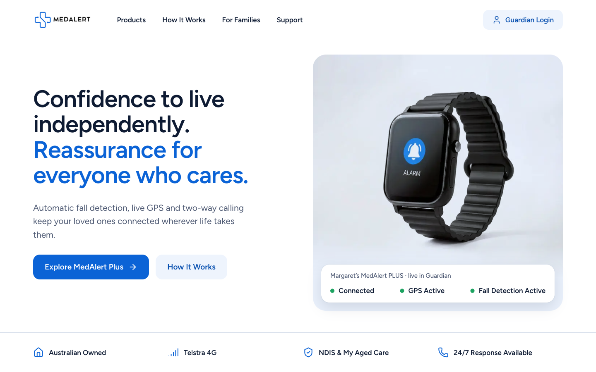
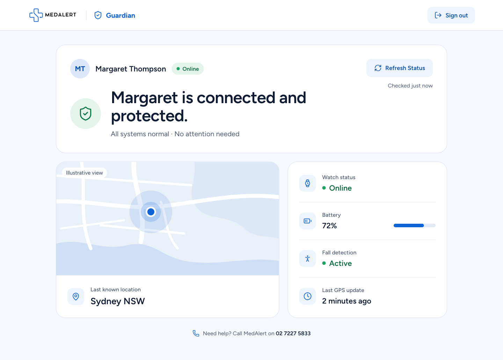

# MedAlert Guardian Prototype

A small Next.js prototype of a modernised MedAlert experience: a homepage hero, a Guardian login, and a Guardian dashboard where a family member checks on Margaret Thompson, the only (fictional) wearer. Authentication and device data are deliberately mocked.

| Route | Purpose |
| --- | --- |
| `/` | Homepage hero |
| `/login` | Guardian Login (`POST /api/auth/login`) |
| `/guardian` | Guardian dashboard (`GET /api/device/margaret`) |




## AI workflow

- **ChatGPT:** challenge decomposition, initial MedAlert/product research, and implementation strategy.
- **Claude Design:** captured the existing MedAlert homepage, MedAlert PLUS product page and comparison page, extracted brand and product context, and created the cohesive homepage, login and Guardian visual direction.
- **Claude Code:** implemented the Next.js app from the Claude Design source, added the mock authentication, the Margaret API endpoint and Refresh Status, and ran build and browser QA.

**How MedAlert context was gathered:** Claude Design inspected these pages directly. The logo and PLUS watch photo in `public/images` come from them.

- https://medalert.io
- https://medalert.io/products/medalert-plus-medical-alert-watch-4g-with-gps
- https://medalert.io/pages/comparison

## Example prompts

**Claude Design (shortened):**
> Capture the three MedAlert pages first, then design one cohesive system across the homepage hero, Guardian Login and Guardian Dashboard. Calm, accessible, no fake health data, green only for real status. Use the real PLUS watch imagery.

**Claude Code (shortened):**
> The Claude Design output is the visual source of truth — don't redesign it. Build it in Next.js + TypeScript + Tailwind with mock server-side auth, a `GET /api/device/margaret` endpoint the dashboard fetches, and a Refresh Status that makes a real request. Apply these human corrections, then lint, build and verify the journeys.

## Human review: where I changed or disagreed with the AI output

- Removed the generated "Forgot password?" link because the challenge did not require the flow.
- Removed extra fictional wearer content and kept the experience focused on Margaret Thompson.
- Did not use the physical watch photograph on the Guardian dashboard because the battery visible in that image conflicted with Margaret's required 72%.
- Added an "Illustrative view" label so the abstract Sydney location visual cannot be mistaken for live map imagery.

## Demo credentials

```
guardian@medalert.demo
guardian123
```

Authentication is mocked: credentials are checked only in the API route, with no database, sessions or auth library. It is not production authentication, and `/guardian` is not access-protected.

## Running locally

```bash
npm install
npm run dev     # http://localhost:3000
```

## Time

Approximate active challenge time: ~15 minutes
